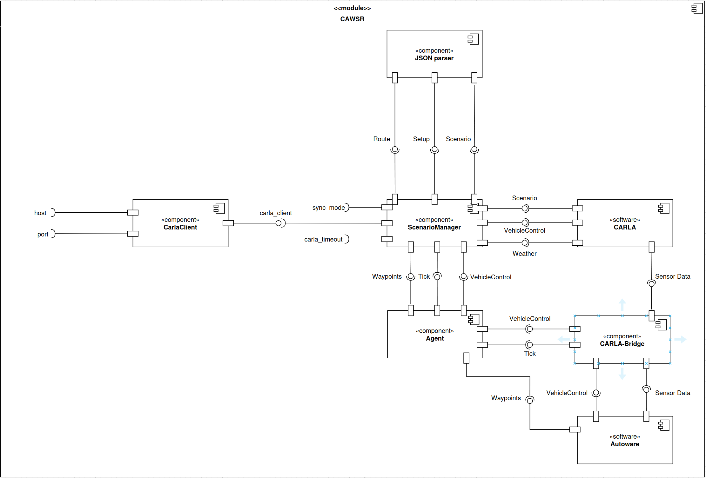
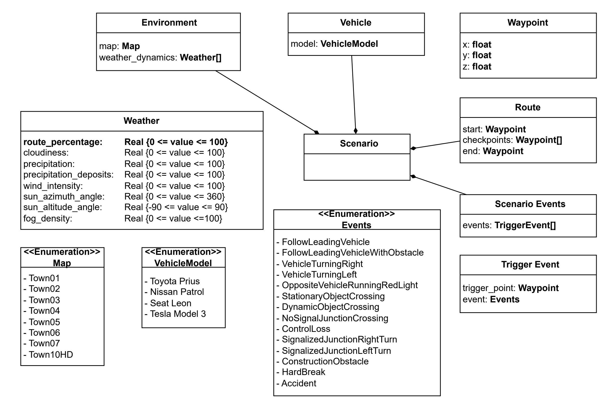

# Summary

CAWSR facilities the testing of the open-source autonomous driving system, Autoware, within CARLA(REFERENCE), the state-of-the-art open-source driving simulator for research. Building on existing tools, this project introduces a testing framework for the execution of complex route-based scenarios, as well as supporting a wide range of experimentally driven verification strategies for scenario generation and optimisation.

# Statement of Need

The concrete aim of this project is to address the verification challenges associated with complex autonomous driving systems (ADS) such as Autoware (REFERENCE), particularly when compared to end-to-end models like Transfuser++ (REFERENCE). CARLA is the choice of the simulator for this tool due its rich ecosystem of open-source tooling and its prominence in the domain of autonomous vehicles. Alternatives such as AWSIM (REFERENCE) have recently been rising in popularity, specifically designed for natively integrating AD systems such as Autoware. However CARLA still remains the standard in end-to-end testing of autonomous vehicles, attributed to its abundant feature set and superior performance in various fidelities (REFERENCE).

In practice, maintaining a consistent testing environment is essential, as simulators can introduce bugs leading to non-deterministic results (OLEK PAPER REFERENCE). While support for Autoware within the CARLA simulator exists (REFERENCE), it does not currently extend to scenario-based testing, a critical component in established frameworks like the CARLA Leaderboard (REFERENCE) and its execution engine, Scenario Runner.

By adhering to the widely used CARLA platform rather than nascent alternatives, this paper introduces a framework directly built on established projects within the CARLA community, facilitating direct comparison with previous agents tested on the CARLA Leaderboard, and ensuring that no additional non-determinism is introduced into the evaluation pipeline. The tool provides an extensible interface for algorithmic scenario generation and optimisation, supporting a wide range of experimentally driven verification strategies based on common evaluation metrics such as the driving score (REFERENCE).

# State of the Field

As previously established, CARLA offers a rich ecosystem of tools and documentation. Multiple frameworks exist for supporting popular open-source AD systems, such as Apollo (apollo-carla-bridge) (REFERENCE) and Autoware (autoware-carla-bridge) (REFERNCE). These tools solve a significant key issue; transforming sensor and control data from CARLA to formats supported by the chosen system. However, native support for scenario execution engines is non-existent, restraining their use for scenario-based testing and verification. These techniques significantly reduce the effort required to validate autonomous driving systems, lowering the technical barrier of entry compared to alternative approaches such as mileage-based testing, which require high startup costs.

The current standard for scenario execution within CARLA is the CARLA Leaderboard (REFERNCE) and its execution engine, Scenario Runner (SR) (REFERNCE). Common use cases of these frameworks include testing end-to-end driving models, such as those based on VLM (Vision Language Models) or Reinforcement Learning. No support is included for testing ROS based AD systems, which focus on a modular approach to autonomous driving, rather than end-to-end. PCLA (REFERENCE), a framework for CARLA, addresses the topic of scenario-testing by creating a clear deployment pipeline for autonomous agents / systems into CARLA, including Autoware. However, their methodology focuses on the simplification of agent implementation and abstraction of setup across various CARLA versions. While this allows for quick use and evaluation without relying on external codebases (such as the CARLA Leaderboard), there is a clear gap on deep intergration between the agent and simulator, limiting the execution of complex, route-based scenarios.

# Tool Summary

CAWSR is a fully synchronous testing-framework directly integrating Scenario Runner. It is built and deployed as a Docker container alongside Autoware (REFERENCE) and includes two main modes of operation. *Algorithm* mode supports the execution of custom verification strategies and algorithms implemented by the user. *Benchmark* mode includes functionality to execute and evaluate a set of scenario definitions empirically. A fully synchronous pipeline has been developed to ensure no new non-determinism is introduced, although some may exist directly within the simulator itself (OLEK PAPER REFERENCE).

To facilitate development, we introduce a new domain model for the definition of route-based scenarios within CARLA, alongside a JSON implementation. This model is based on the format introduced by Scenario Runner, facilitating support between both frameworks.

# Conclusion

# Acknowledgements

This work was supported by the Institute of Information & Communications Technology Planning & Evaluation(IITP) grant funded by the Korea government(MSIT) (No. RS-2025-02218761, 50%) and by the Engineering and Physical Sciences Research Council (EPSRC) [EP/Y014219/1].

# References
